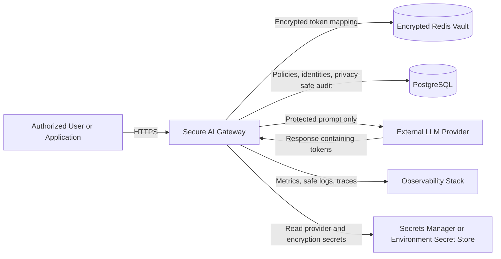
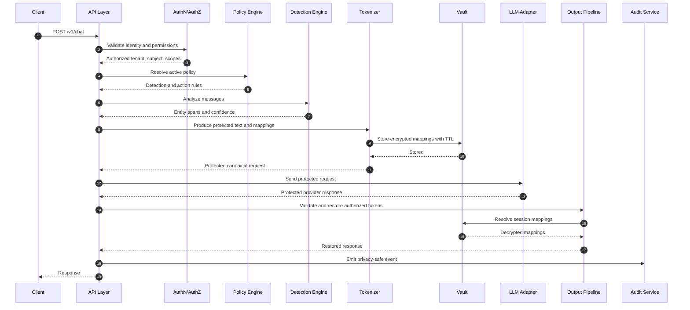
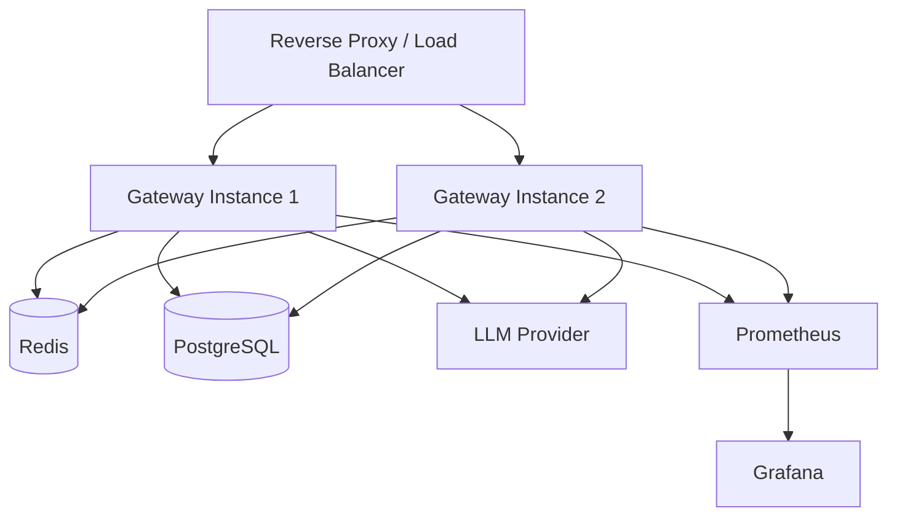
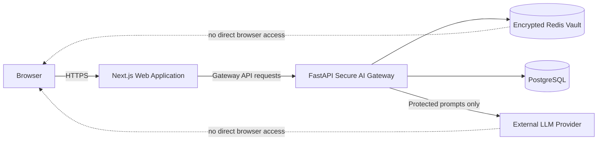

# Secure AI Gateway — Architecture Specification

**Document:** `architecture.md`  
**Status:** Implementation baseline  
**Audience:** Software architects, security engineers, backend engineers, DevOps engineers, Claude Code  
**Primary objective:** Prevent raw sensitive data from being transmitted to external LLM providers while preserving enough context for useful model reasoning.

---

## 1. Executive Summary

The Secure AI Gateway is a self-hosted privacy and policy enforcement layer positioned between client applications and external or internal large language model providers.

For every request, the gateway:

1. Authenticates and authorizes the caller.
2. Validates and normalizes the request.
3. Detects configured sensitive entities.
4. Replaces sensitive values with stable, typed, session-scoped tokens.
5. Stores the reversible mapping in an encrypted, session-isolated vault.
6. Sends only the protected prompt to the selected LLM provider.
7. inspects the provider response.
8. Restores original values only for authorized recipients.
9. Emits privacy-safe audit events and operational metrics.
10. Deletes mappings automatically when the session expires.

The initial implementation is a modular monolith built with Python and FastAPI. Redis is used as an ephemeral mapping vault. PostgreSQL is used for users, API clients, policies, provider configuration metadata, and privacy-safe audit records. Provider access is implemented behind an abstraction so OpenAI can be the first provider without coupling the security pipeline to one vendor.

---

## 2. Problem Statement

Enterprise prompts may contain personally identifiable information, protected health information, payment information, credentials, confidential identifiers, or other regulated data. Sending this data directly to an external LLM creates unnecessary exposure and complicates governance.

The gateway must ensure that external providers receive protected text such as:

```text
[PERSON:7F3A] was diagnosed with [MEDICAL_CONDITION:84C2].
Contact [EMAIL:19BD] for follow-up.
```

instead of:

```text
Jane Smith was diagnosed with diabetes.
Contact jane.smith@example.com for follow-up.
```

The gateway must later convert provider output containing the protected tokens back into authorized original values without placing the mapping in the model prompt.

---

## 3. Goals

### 3.1 Functional goals

- Provide a synchronous chat endpoint.
- Detect PII and configurable PHI or enterprise-sensitive entities.
- Support deterministic, reversible, session-scoped tokenization.
- Preserve repeated-entity consistency within a session.
- Store token mappings in an encrypted vault with TTL.
- Call an external LLM without transmitting original sensitive values.
- Restore recognized tokens in the model response.
- Prevent cross-session token restoration.
- Produce privacy-safe audit records.
- Support policy-based allow, tokenize, redact, pseudonymize, or block actions.
- Keep provider integrations replaceable.
- Expose health, readiness, and Prometheus metrics endpoints.
- Support local development with Docker Compose.

### 3.2 Security goals

- Raw sensitive values must not appear in provider-bound payloads.
- Raw sensitive values must not appear in application logs, traces, metrics, audit tables, exceptions, or dead-letter records.
- Vault records must be encrypted at the application layer before storage.
- Tokens must be unguessable, typed, and scoped to a tenant and session.
- Authorization must be checked before restoration.
- Session mappings must expire.
- Provider credentials must remain server-side.
- Fail closed when privacy processing cannot safely complete.

### 3.3 Quality goals

- Strong typing and modular boundaries.
- Unit, integration, privacy-regression, and security tests.
- Idempotent migrations and reproducible environments.
- Clear configuration through environment variables.
- Traceability through request IDs without logging prompt contents.

---

## 4. Non-Goals for Version 1

Version 1 does not attempt to provide:

- Formal HIPAA, GDPR, PCI DSS, FedRAMP, or other compliance certification.
- Perfect detection of every sensitive entity.
- Full data-loss-prevention coverage for files, images, audio, or video.
- Automatic clinical diagnosis or medical decision support.
- A general-purpose secrets-management product.
- Long-term storage of raw conversations.
- A full web administration dashboard.
- Multi-region active-active deployment.
- Differential privacy.
- Homomorphic encryption.
- Model-output factuality or hallucination guarantees.
- Autonomous prompt-injection classification using another external LLM.

These may be added later without weakening the core privacy boundary.

---

## 5. Architectural Principles

### 5.1 Privacy before availability

If the detector, tokenizer, vault, policy engine, or restoration authorization check fails, the system must not forward the original request to an external provider.

### 5.2 Stateless gateway, stateful vault

API instances remain horizontally scalable and do not store mappings in process memory. Reversible state belongs in the vault.

### 5.3 Provider isolation

Provider adapters receive only an already-protected canonical request. They must never receive direct access to vault APIs.

### 5.4 Least privilege

Each component, service account, API client, and operator receives the minimum permission required.

### 5.5 Data minimization

Store only what is needed, for only as long as needed. Audit logs contain classifications, counts, hashes, outcomes, and timing—not raw prompt or response content.

### 5.6 Explicit policy

Behavior is controlled through versioned policies. Security-sensitive defaults are deny or tokenize, not allow.

### 5.7 Defense in depth

Detection uses multiple recognizers, including pattern matching, checksums, NER, allowlists, denylists, and custom recognizers.

---

## 6. System Context



### Trust boundaries

1. **Client boundary:** Untrusted input enters the system.
2. **Application boundary:** Gateway code and internal services are trusted but still validated.
3. **Vault boundary:** Raw mappings exist only in encrypted form outside application memory.
4. **Provider boundary:** All data leaving this boundary must already be protected.
5. **Observability boundary:** No raw sensitive values may cross into logs, metrics, or traces.

---

## 7. High-Level Request Flow



---

## 8. Deployment Architecture

### 8.1 Version 1 topology



### 8.2 Runtime model

Use a modular monolith initially:

- One FastAPI deployment.
- Separate modules with dependency inversion.
- Redis and PostgreSQL as external state.
- Background cleanup is optional because Redis TTL is authoritative.
- Horizontal scaling is achieved by adding gateway replicas.

A later service split may extract detection, policy, or audit components when operational evidence justifies it.

---

## 9. Core Components

## 9.1 API Layer

**Responsibilities**

- Expose versioned HTTP endpoints.
- Parse and validate requests.
- Assign a request ID.
- Enforce body-size and message-count limits.
- Invoke authentication, authorization, rate limiting, and the secure pipeline.
- Convert domain errors into stable error responses.
- Never log request or response bodies.

**Inputs**

- HTTPS requests containing messages, provider alias, model alias, and optional session ID.

**Outputs**

- Restored completion, usage metadata, request ID, session ID, and privacy metadata safe for the caller.

**Failure behavior**

- Reject malformed requests with `400` or `422`.
- Reject unauthenticated requests with `401`.
- Reject unauthorized requests with `403`.
- Reject rate-limited requests with `429`.
- Return a sanitized `5xx` error without echoing prompt content.

---

## 9.2 Authentication and Authorization

Version 1 supports API-key authentication. JWT/OIDC can be added behind the same interface.

An API key record contains:

- `id`
- `tenant_id`
- `name`
- `key_prefix`
- `key_hash`
- `scopes`
- `status`
- `created_at`
- `expires_at`
- `last_used_at`

Only a one-way hash is stored. The raw API key is shown once at creation.

Required scopes:

- `chat:invoke`
- `detect:invoke`
- `sessions:delete`
- `audit:read`
- `admin:manage`

Authorization context:

```python
class Principal:
    subject_id: UUID
    tenant_id: UUID
    scopes: frozenset[str]
    api_key_id: UUID | None
```

Every session and vault lookup must include `tenant_id`. Session IDs alone are not sufficient authorization.

---

## 9.3 Policy Engine

The policy engine resolves one immutable policy snapshot for each request.

A policy defines:

- Supported entity types.
- Detection score thresholds.
- Entity action: `ALLOW`, `TOKENIZE`, `REDACT`, `PSEUDONYMIZE`, or `BLOCK`.
- Whether input restoration is permitted in output.
- Session TTL.
- Maximum request size.
- Provider and model allowlist.
- Input and output scanning settings.
- Unknown-token behavior.
- Streaming permission.
- Audit retention class.

Policy precedence:

1. Tenant-specific active policy.
2. Application-specific override.
3. System default.

The resolved policy version is recorded in the audit event.

---

## 9.4 Sensitive Data Detection Engine

The detector combines:

- Microsoft Presidio analyzer recognizers.
- Regex and checksum-based recognizers.
- spaCy-based NER where configured.
- Custom enterprise recognizers.
- Tenant allowlists and denylists.
- Context words to improve confidence.

Domain interface:

```python
class SensitiveDataDetector(Protocol):
    async def detect(
        self,
        text: str,
        language: str,
        entity_types: set[str] | None,
    ) -> list["DetectedEntity"]:
        ...
```

Entity model:

```python
class DetectedEntity:
    entity_type: str
    start: int
    end: int
    score: float
    recognizer: str
```

Initial entity types:

- `PERSON`
- `EMAIL_ADDRESS`
- `PHONE_NUMBER`
- `US_SSN`
- `CREDIT_CARD`
- `IP_ADDRESS`
- `LOCATION`
- `DATE_TIME`
- `US_DRIVER_LICENSE`
- `US_PASSPORT`
- `MEDICAL_RECORD_NUMBER`
- `HEALTH_PLAN_ID`
- `ACCOUNT_NUMBER`
- `API_KEY`
- `ACCESS_TOKEN`
- `CUSTOM_IDENTIFIER`

Medical conditions are not reliably detected by generic PII tooling. Treat PHI expansion as custom recognizers plus domain-specific models and policy testing, not as a guaranteed built-in capability.

### Overlap resolution

When recognizers produce overlapping spans:

1. Higher policy severity wins.
2. Higher confidence wins.
3. Longer span wins.
4. Deterministic recognizer priority breaks remaining ties.

### False-positive controls

- Exact allowlists.
- Context requirements.
- Minimum confidence by entity type.
- Checksum validation where applicable.
- Tests built from organization-specific examples.

---

## 9.5 Tokenization Engine

### Token requirements

Tokens must be:

- Typed.
- Opaque.
- Session-scoped.
- Tenant-scoped through vault lookup.
- Stable for repeated identical values within one session.
- Unlikely to occur naturally in text.
- Resistant to user fabrication.
- Easy to identify safely in provider output.

Canonical token format:

```text
⟦SGW:PERSON:01J8Z6J4M7Y9Q2K3T4V5W6X7Y8⟧
```

The final segment is a random ULID or equivalent cryptographically strong identifier. Do not use sequential tokens such as `PERSON_1` in production.

### Canonicalization

Repeated-entity consistency uses an HMAC of:

```text
tenant_id || session_id || entity_type || normalized_value
```

The HMAC is used only as an internal lookup index and is never sent externally.

Normalization is entity-specific:

- Emails: trim surrounding whitespace; preserve original case for restoration.
- Phone numbers: normalize digits for matching; preserve original format.
- Names: trim and collapse repeated whitespace; do not lowercase unless policy explicitly permits it.
- Identifiers: remove presentation separators only when recognizer semantics allow.

### Replacement algorithm

1. Detect all spans.
2. Resolve overlaps.
3. Sort spans descending by start offset.
4. For each span:
   - Apply policy action.
   - Generate or reuse a token.
   - Add mapping to an in-memory request collection.
   - Replace the span.
5. Persist all new mappings atomically.
6. Zero or release unnecessary plaintext references as soon as practical.

Replacing from right to left prevents offset invalidation.

### Policy actions

- `ALLOW`: leave text unchanged.
- `TOKENIZE`: replace with opaque typed token and store mapping.
- `REDACT`: replace with `⟦SGW:REDACTED:TYPE⟧`; do not store mapping.
- `PSEUDONYMIZE`: replace using a policy-approved surrogate; optionally store mapping.
- `BLOCK`: stop processing and return a policy violation.

---

## 9.6 Session Vault

Redis stores short-lived encrypted mappings.

### Key design

```text
sgw:v1:{tenant_id}:{session_id}:token:{token_id}
sgw:v1:{tenant_id}:{session_id}:fingerprint:{entity_type}:{value_hmac}
sgw:v1:{tenant_id}:{session_id}:meta
```

### Mapping payload before encryption

```json
{
  "schema_version": 1,
  "tenant_id": "uuid",
  "session_id": "uuid",
  "token": "opaque-token",
  "entity_type": "EMAIL_ADDRESS",
  "original_value": "jane@example.com",
  "created_at": "RFC3339 timestamp",
  "expires_at": "RFC3339 timestamp"
}
```

### Encryption

Use application-layer authenticated encryption:

- AES-256-GCM or ChaCha20-Poly1305.
- Random nonce per record.
- Associated data includes schema version, tenant ID, session ID, and token ID.
- Encryption keys are loaded from a secrets manager or environment-backed development secret.
- Key IDs support rotation.
- Plaintext encryption keys are never logged or stored in PostgreSQL.

Stored envelope:

```json
{
  "kid": "vault-key-2026-01",
  "alg": "AES-256-GCM",
  "nonce": "base64",
  "ciphertext": "base64"
}
```

### TTL

- Default: 30 minutes.
- Configurable policy range: 1–120 minutes.
- Every mapping and session metadata key receives TTL.
- Session extension is explicit and bounded.
- `DELETE /v1/sessions/{session_id}` removes all session mappings.

### Atomicity

Use a Redis transaction or Lua script to:

- Create the fingerprint index if absent.
- Create the encrypted token record.
- Set identical TTL values.
- Return an existing token for a repeated value.
- Avoid duplicate mappings under concurrency.

### Redis failure policy

If Redis is unavailable before the provider call, return `503` and do not call the provider.

If Redis becomes unavailable after the provider call but before restoration, return a sanitized `503`; do not return unresolved model output containing security tokens as a normal answer.

---

## 9.7 LLM Provider Abstraction

Provider adapters consume only protected canonical requests.

```python
class LLMProvider(Protocol):
    async def complete(self, request: "ProtectedChatRequest") -> "ProviderResponse":
        ...

    async def stream(self, request: "ProtectedChatRequest") -> AsyncIterator["ProviderChunk"]:
        ...

    async def health(self) -> "ProviderHealth":
        ...
```

Version 1 adapter:

- OpenAI provider adapter.
- Use the provider's current recommended text-generation API.
- Disable provider-side storage where supported and required by configuration.
- Set strict connection, read, and total timeouts.
- Apply bounded retries only for safe transient failures.
- Never retry policy violations or invalid requests.
- Record provider request IDs only when safe.

Future adapters may include Azure OpenAI, Anthropic, Amazon Bedrock, Gemini, and local models.

Provider configuration refers to aliases, not arbitrary caller-supplied base URLs. This prevents SSRF and unapproved egress.

---

## 9.8 Output Security and Restoration

The output pipeline:

1. Validates provider response structure.
2. Applies size limits.
3. Optionally scans for newly introduced sensitive data.
4. Finds gateway tokens with a strict parser.
5. Resolves only tokens belonging to the authenticated tenant and request session.
6. Restores mapped values.
7. Handles unknown or malformed tokens according to policy.
8. Emits privacy-safe result metadata.

### Token parser

Do not restore through unconstrained global string replacement. Parse the exact token grammar and match complete tokens only.

### Unknown-token behavior

Default behavior:

- Keep unknown tokens protected.
- Add a warning flag to metadata.
- Never search other sessions.
- Never infer a value.
- Never expose whether a token exists in another tenant.

### Newly generated PII

A model may generate PII-like text not present in the input. Output scanning can:

- Allow.
- Redact.
- Block.
- Require human review.

Version 1 defaults to scanning and reporting counts without claiming perfect prevention.

---

## 9.9 Audit Service

Audit records must not contain raw prompts, raw responses, decrypted values, provider credentials, or complete gateway tokens.

Suggested fields:

- `id`
- `timestamp`
- `request_id`
- `tenant_id`
- `principal_id`
- `api_key_id`
- `session_id_hash`
- `policy_id`
- `policy_version`
- `provider_alias`
- `model_alias`
- `input_character_count`
- `output_character_count`
- `entity_counts_json`
- `actions_json`
- `blocked`
- `block_reason_code`
- `provider_latency_ms`
- `pipeline_latency_ms`
- `status_code`
- `error_code`
- `prompt_hmac`
- `response_hmac`

Use keyed HMACs for correlation; do not use unsalted plain hashes for sensitive text.

Audit writes must not delay the response indefinitely. Use an in-process bounded queue in version 1, with safe fallback counters. Never queue raw content.

---

## 9.10 Logging, Metrics, and Tracing

### Logs

Use structured JSON logs with:

- timestamp
- level
- request_id
- tenant_id
- route
- status_code
- error_code
- duration_ms

Prohibited:

- request bodies
- response bodies
- original sensitive values
- decrypted mappings
- authorization headers
- API keys
- provider keys
- full gateway tokens

Install a defensive log filter that masks token grammar and common secrets even if a developer accidentally includes them.

### Metrics

Initial Prometheus metrics:

- `sgw_http_requests_total`
- `sgw_http_request_duration_seconds`
- `sgw_detection_duration_seconds`
- `sgw_entities_detected_total{entity_type,action}`
- `sgw_policy_blocks_total{reason}`
- `sgw_vault_operations_total{operation,result}`
- `sgw_vault_duration_seconds`
- `sgw_provider_requests_total{provider,model,result}`
- `sgw_provider_duration_seconds{provider,model}`
- `sgw_restoration_unknown_tokens_total`
- `sgw_active_requests`
- `sgw_audit_queue_depth`

Do not use tenant ID, user ID, session ID, request ID, or token values as metric labels.

### Tracing

Trace spans may contain component names, timing, and result codes. Prompt text and mappings are forbidden span attributes.

---

## 9.11 Document Storage

Extends the gateway from prompt text to files. **Storage, extraction, and
segmentation are built; everything downstream of them is not** — there is no
detection, tokenization, or restoration for documents. The full specification,
with the built/specified boundary marked at each step, is
[docs/document-processing.md](docs/document-processing.md).

### Responsibilities

Accept an uploaded file, validate it at the boundary, seal it, put it in
S3-compatible object storage, and give it back to exactly one principal. Store
metadata in PostgreSQL and document bytes nowhere else.

### Structure

| Module | Responsibility |
|---|---|
| `app/documents/validation.py` | Pure boundary checks: filename, type, length |
| `app/documents/crypto.py` | The wire format and the chunked cipher |
| `app/documents/models.py` | Domain types and the accepted-type table |
| `app/documents/protocol.py` | The `DocumentStore` seam |
| `app/documents/storage/s3.py` | aioboto3 adapter — MinIO, S3, or any compatible endpoint |
| `app/documents/storage/fakes.py` | In-memory store for tests in other packages |
| `app/documents/repository.py` | Tenant- and user-scoped metadata access |
| `app/documents/service.py` | Order of operations, and the consistency guarantee |
| `app/api/v1/documents.py` | Four routes under `/v1` |

Nothing above the `DocumentStore` protocol knows whether it is talking to MinIO
or AWS. Nothing below it knows what a document is.

### Encryption

Per-document data keys derived with HKDF-SHA256, then AES-256-GCM applied
**per chunk** rather than to the whole document — single-shot GCM would force a
25 MiB file into memory to encrypt and again to verify. Associated data binds
tenant, user, document, content type, schema version, purpose, chunk index, and
a final-chunk flag. See ADR-0020 and ADR-0021 for the format and the reasoning.

### Storage layout

| Where | What |
|---|---|
| Object store | Ciphertext, under a random opaque key with a `documents/` prefix, written as `application/octet-stream` with no user metadata |
| PostgreSQL | Identifiers, content type, byte size, SHA-256, status, timestamps, and the **encrypted** filename |
| Anywhere else | Nothing |

### Streaming and multipart

Both directions stream. The adapter switches to S3 multipart past the part
threshold and fills each part to the 5 MiB minimum, because S3 rejects any part
but the last below it. Any failure — including a client disconnect arriving as
task cancellation — aborts the upload explicitly, because abandoned parts do not
appear in an object listing and are billed until a lifecycle rule finds them.

### Consistency

A document is a row and an object with no transaction spanning the two, so
ordering carries the guarantee: validate, insert `receiving`, stream and seal
and upload, then mark `stored`. Deletion runs object-first. The invariant is
that a row never claims `stored` for an object that is not there, and no object
survives with nothing pointing at it.

### Failure behaviour

Fail closed (ADR-0008). An unreachable object store fails the upload and marks
the row `failed`; readiness reports `object_store: down` while liveness stays
up. `DOCUMENTS_ENABLED=false` unmounts the routes entirely and removes the
object-store configuration requirement, so a deployment that does not accept
uploads is not made to configure a bucket.

---

## 9.12 Document Extraction and Segmentation

Turns a stored document into ordered segments a detector can run over. Reached
only through §9.13; no route reaches it directly.

### Structure

| Module | Responsibility |
|---|---|
| `app/documents/extraction/models.py` | `ExtractedDocument` — one text buffer, pages as ranges |
| `app/documents/extraction/extractors.py` | Pure, picklable per-type parsing plus its guards |
| `app/documents/extraction/runner.py` | The `ExtractionRunner` seam and the subprocess isolation |
| `app/documents/segmentation.py` | Boundary rules, overlap, and global offsets |
| `app/documents/processing.py` | `DocumentProcessor` — open, decrypt, extract, segment |

### Isolation (ADR-0028)

One **spawned** subprocess per document, concurrency capped by an
`asyncio.Semaphore`, and a wall-clock timeout that `terminate()`s the worker
rather than abandoning it. Only bytes and safe reason codes cross the boundary;
exceptions are never pickled back, because a traceback holds frames that hold
the document. The child is reaped on every exit path.

`spawn` rather than `fork` on every platform: a forked child would inherit the
parent's memory — key rings, sockets, the audit queue — into the process whose
whole job is running a parser over an attacker's file.

### Types and guards

TXT (strict UTF-8), PDF (pypdf, per-page text, encrypted files refused), and
DOCX (python-docx, paragraphs and table cells, one page because a DOCX stores no
pagination). A DOCX is a ZIP, so its expansion ratio and member count are checked
against the central directory *before* anything is decompressed. The extracted
character count is bounded inside the worker while accumulating.

`pypdf`, `docx`, and `lxml` have their logger floors raised to `INFO`, applied
inside the child as well as the parent.

### Offsets (ADR-0029)

One canonical text buffer; pages and segments are ranges into it with global
offsets, derived by slicing rather than copied. Pages must be ordered,
non-overlapping, contiguous, and cover the buffer exactly — a gap or an overlap
is refused at construction, so offset drift is unrepresentable.

### Segmentation

Whitespace-aware boundaries plus overlap. The overlap is a privacy control: an
entity shorter than it is guaranteed to appear whole in at least one segment,
and a boundary falling mid-value is a fail-open condition. Duplicate detections
across overlapping segments collapse on their global offsets.

### Retention (ADR-0030)

Extracted text is never persisted — no table, no object, no temporary file. It
exists for the life of one call. Because nothing is stored, no `DocumentStatus`
member was added and no migration was written.

### Failure behaviour

Fail closed. A file that Phase 1 stored can still be refused here, with
`DOCUMENT_EXTRACTION_FAILED` (422) for an unparseable file or
`DOCUMENT_EXTRACTION_TIMEOUT` (503) for one that overran its budget. Extraction
failing does not destroy the caller's stored document.

---

## 9.13 Document Detection and Labeled Spans

Runs the detector over every segment and merges the results into one set of
document-global spans, each carrying the policy's decision. **Nothing invokes it
yet**: `DocumentAnalyzer` is assembled by the composition root, but no route
reaches it and no other module calls it. It becomes reachable in the phase that
protects a document.

### Structure

| Module | Responsibility |
|---|---|
| `app/documents/analysis/models.py` | `LabeledSpan` and `AnalyzedDocument` — the checkpoint types |
| `app/documents/analysis/spans.py` | The pure span algebra: promote, coalesce, filter, resolve, label |
| `app/documents/analysis/analyzer.py` | `DocumentAnalyzer` — orchestration, bounds, and refusals |

### Merging (ADR-0031)

Segmentation hands the detector overlapping windows on purpose, so the same
value is reported more than once and a cut can manufacture a fragment that still
looks like a whole entity. Five steps, in this order:

1. **Promote** to global offsets via `Segment.to_global`.
2. **Coalesce** on `(entity_type, start, end)`, keeping the highest score and the
   union of segment indexes.
3. **Select confident** against the policy's `min_score` for the type.
4. **Resolve overlaps** with the §9.4 rule. A fragment loses to the whole value
   because that rule already prefers the longer span.
5. **Label** with the policy's action and the pages touched.

Steps 3 and 4 are in that order because the reverse loses values: severity is
the first key of the ordering rule, so a sub-threshold high-severity span can
win a contest and then be dropped, leaving nothing protecting those characters.

Detection is **not** narrowed to the policy's entity types, and diagnostics are
off and not configurable.

### Readiness (ADR-0032)

An `AnalyzedDocument` cannot hold overlapping, backwards, out-of-range, or
blocked spans — construction refuses all four. The phase that protects a
document therefore re-validates none of it. No `DocumentStatus` member and no
migration: nothing is persisted, so there is nothing for a status to describe.

### Bounds and failure behaviour

`DOCUMENT_DETECTION_CONCURRENCY` bounds segments detected at once, shared across
documents. `MAX_DOCUMENT_ENTITIES` bounds labeled spans per document — a
deployment setting rather than the policy's per-request `max_entities`, which is
sized for a prompt.

Fail closed throughout. A blocked entity type raises `POLICY_VIOLATION` (422)
naming the type and never the value; an over-budget document raises
`ENTITY_LIMIT_EXCEEDED` (422); a detector that cannot run raises
`PRIVACY_DETECTOR_UNAVAILABLE` (503). One failing segment cancels the rest.

---

## 9.14 Document Protection

Applies the labeled spans and persists the mappings they need. **Nothing invokes
it yet**: `DocumentProtector` is assembled by the composition root, but no route
reaches it and no other module calls it. It becomes reachable in the phase that
sends a document to a provider.

`app/documents/protection.py` is one module, and it **calls the prompt
tokenizer** rather than implementing a second one (ADR-0033). The two things a
document-specific implementation would duplicate are the two where a mistake is
silent: the splice runs right to left because every offset indexes the original
string, and mappings are minted in one call (ADR-0022).

Three things make that reuse safe:

| Concern | Answer |
|---|---|
| Which policy | The snapshot `AnalyzedDocument` carries. Re-resolving could apply actions the labels never agreed to |
| Which budget | `MAX_DOCUMENT_ENTITIES`, substituted through a read-through view. The tokenizer's own ceiling is per-request |
| Which session | The caller's. A token resolves only in the session it was minted in |

The tokenizer re-derives actions from the policy it is given, and the protector
**verifies the derivation reproduced the labels** — refusing a result that acted
on a different number of spans than were labeled, rather than sending text with
an original still in it.

`ProtectedDocument` is the provider checkpoint, the document-shaped counterpart
of `ProtectedChatRequest`. It carries no mappings; the originals are in the
vault. A blocked entity type is refused by detection, before protection begins,
so a document destined to fail reaches no vault call.

---

## 9.15 Outbound Attestation and the Document Route

The last four stages, and the first place in this system where a privacy claim
produces evidence rather than resting on a test (ADR-0024).

| Module | Responsibility |
|---|---|
| `app/documents/outbound.py` | Canonical serialization and the pre-transmission scan |
| `app/documents/pipeline.py` | `DocumentPipeline` — stage order, refusals, and the audit row |
| `app/api/v1/documents.py` | `POST /v1/documents/{id}/process` |

### Order

`protect → serialize → scan → transmit → restore → attest`. Serialization
produces **one** byte string, used for all three of the scan, the transmission,
and the attestation; three renderings would be three chances to check one thing
and send another. The scan runs before the provider call, because afterwards a
check is a report rather than a control.

### Serialization

Framing version, provider alias, model alias, policy version, and each message's
role and content, length-prefixed. Not the provider's wire format — that belongs
to the adapter and changes with its SDK. The request id is outside the frame so
identical payloads attest identically and a digest can be recomputed.

### The scan

Detection over the exact payload; any finding the policy would act on refuses the
request. Detections inside a gateway token or a redaction are discarded first: a
token's 26-character identifier reads as an account number, and without that
exclusion the scan would flag the substitutions protection just made.

### Attestation

`audit_events.outbound_hmac` (keyed digest of the transmitted bytes, its own
domain constant) and `audit_events.outbound_scan` (`clean` or `blocked`), written
on both paths. A digest, never a payload.

### The route

Requires `documents:read` **and** `chat:invoke`. The instruction travels as a
system message, separate from the document and untokenized.

---

## 10. API Contract Summary

### `POST /v1/chat`

Request:

```json
{
  "session_id": "optional UUID",
  "provider": "openai-primary",
  "model": "general-chat",
  "messages": [
    {"role": "user", "content": "My email is jane@example.com"}
  ],
  "temperature": 0.2,
  "max_output_tokens": 800
}
```

Response:

```json
{
  "request_id": "UUID",
  "session_id": "UUID",
  "message": {
    "role": "assistant",
    "content": "I will use jane@example.com for follow-up."
  },
  "privacy": {
    "entities_detected": 1,
    "entities_tokenized": 1,
    "unknown_tokens": 0,
    "policy_version": 3
  },
  "usage": {
    "input_tokens": 18,
    "output_tokens": 12
  }
}
```

### `POST /v1/detect`

Administrative or diagnostic endpoint. It returns spans, types, scores, and intended actions. It must require a dedicated scope. By default, it must not echo original values.

### `POST /v1/documents`

`multipart/form-data` upload of one TXT, PDF, or DOCX file, sealed and stored.
Requires the `documents:write` scope. Returns the stored document's metadata and
its filename; never a storage key. Exempt from the JSON body size limit and
bounded instead by `MAX_DOCUMENT_BYTES`, checked both from the declared
`Content-Length` and from the real byte count as it streams.

### `GET /v1/documents/{document_id}`

Streams the original bytes back to the principal that uploaded them. Requires
`documents:read`. Sends `Cache-Control: no-store` and an RFC 5987–encoded
`Content-Disposition`, because a filename may hold non-ASCII characters and a
raw one in a header is a response-splitting risk.

### `GET /v1/documents/{document_id}/status`

Metadata only — `receiving`, `stored`, or `failed`. Touches no key and reads no
object, so polling is cheap and never causes a decryption. Deliberately carries
no filename.

### `DELETE /v1/documents/{document_id}`

Destroys the object and the row. Answers `204` whether or not the document
existed, for the same reason session deletion does: a different answer for
"never existed" would make this an oracle for which document ids are real.

### `DELETE /v1/sessions/{session_id}`

Deletes all mappings for the caller's tenant and specified session.

### `GET /health/live`

Confirms the process is alive. It must not require external dependencies.

### `GET /health/ready`

Checks required dependencies, including Redis, PostgreSQL, and provider configuration. It should not perform a paid model inference.

### `GET /metrics`

Prometheus endpoint, protected by network policy or dedicated authentication.

---

## 11. Canonical Domain Models

```python
class ChatMessage(BaseModel):
    role: Literal["system", "user", "assistant"]
    content: str

class ChatRequest(BaseModel):
    session_id: UUID | None = None
    provider: str
    model: str
    messages: list[ChatMessage]
    temperature: float | None = None
    max_output_tokens: int | None = None

class EntityAction(str, Enum):
    ALLOW = "allow"
    TOKENIZE = "tokenize"
    REDACT = "redact"
    PSEUDONYMIZE = "pseudonymize"
    BLOCK = "block"

class EntityMapping:
    token: str
    token_id: str
    entity_type: str
    original_value: str
    normalized_hmac: str

class ProtectedChatRequest:
    request_id: UUID
    tenant_id: UUID
    session_id: UUID
    provider_alias: str
    model_alias: str
    messages: list[ChatMessage]
```

The protected request type must be distinct from the raw request type to reduce accidental provider calls with unprocessed data.

---

## 12. Data Model

### PostgreSQL tables

#### `tenants`

- `id UUID PK`
- `name TEXT`
- `status TEXT`
- timestamps

#### `api_keys`

- identity and one-way key hash
- tenant relationship
- scopes
- expiry and status

#### `policies`

- `id UUID PK`
- `tenant_id UUID NULL`
- `name`
- `version`
- `document JSONB`
- `is_active`
- timestamps
- unique `(tenant_id, name, version)`

#### `provider_configs`

- aliases and non-secret metadata
- model allowlists
- timeout and retry policies
- secret reference, not secret value

#### `audit_events`

- privacy-safe metadata described earlier
- partitionable by month later

### Redis

Redis is authoritative only for ephemeral mapping state. It is not a system of record for users, policies, or audit.

---

## 13. Security Controls

### Input controls

- Maximum HTTP body size.
- Maximum number of messages.
- Maximum characters per message.
- Unicode normalization policy.
- Reject invalid encodings and control-character abuse.
- Restrict roles.
- Restrict provider and model aliases.
- Rate limit per API key and tenant.
- Optional prompt-injection heuristics operate independently from PII protection.

### Network controls

- HTTPS at ingress.
- TLS to Redis and PostgreSQL in non-local environments.
- Egress allowlist for approved LLM provider hosts.
- No caller-controlled URLs.
- Private subnets for data stores.
- Network policies between workloads.

### Secret controls

- Secrets loaded at runtime.
- No secrets committed to source control.
- `.env.example` contains names only.
- Provider keys scoped and rotated.
- Vault encryption key rotation through `kid`.
- Startup validation rejects missing or weak secrets.

### Application controls

- Parameterized database access.
- Pydantic validation.
- Safe error mapping.
- Dependency pinning and vulnerability scanning.
- CSRF is not relevant for API-key-only service but must be addressed when browser sessions are added.
- CORS is deny-by-default.

---

## 14. Threat Model Summary

| Threat | Example | Control |
|---|---|---|
| PII exfiltration | Raw SSN sent to provider | Mandatory detection and tokenization; provider adapter accepts protected type only |
| Log leakage | Prompt included in exception | Body-free structured logs and redaction filter |
| Cross-tenant restoration | Token from tenant A used by tenant B | Tenant-qualified vault keys and authorization context |
| Token guessing | Attacker fabricates `PERSON_1` | Random opaque token IDs and strict parser |
| Session fixation | Caller selects another session | Tenant ownership validation and unguessable UUIDs |
| Replay | Reusing old session token | TTL, API authentication, bounded session lifetime |
| Vault theft | Redis snapshot exposed | Application-layer authenticated encryption |
| SSRF | Caller supplies provider URL | Provider aliases and egress allowlist |
| Provider outage | Timeout causes insecure bypass | Fail closed; never send raw fallback request |
| Prompt injection | Prompt asks system to expose tokens | Tokens are placeholders; mapping never enters model context |
| Mapping oracle | Error reveals token existence | Uniform unknown-token behavior |
| Denial of service | Huge prompt or many entities | Body, entity, concurrency, and rate limits |
| Supply-chain compromise | Malicious package update | Lock file, hashes where supported, scanning, minimal dependencies |

A full STRIDE review should be maintained as the project evolves.

---

## 15. Failure Modes

### Detector unavailable

Return `503 PRIVACY_DETECTOR_UNAVAILABLE`. Do not call provider.

### Unsupported language

Apply policy. Default is block with `422 UNSUPPORTED_LANGUAGE`, not silent bypass.

### Too many entities

Return `413 ENTITY_LIMIT_EXCEEDED` or block according to policy.

### Vault write failure

Return `503 VAULT_UNAVAILABLE`. Do not call provider.

### Provider timeout

Return `504 PROVIDER_TIMEOUT`. Keep mappings until normal TTL.

### Provider returns malformed data

Return `502 PROVIDER_RESPONSE_INVALID`.

### Restoration failure

Return `503 RESTORATION_FAILED`. Do not silently expose unresolved output as a successful response.

### Audit write failure

Complete request only if the configured audit policy permits. Increment a high-priority metric and log a privacy-safe event.

---

## 16. Performance and Capacity Targets

Initial service-level objectives, excluding provider generation time:

- p50 gateway overhead: under 100 ms for 4 KB English text.
- p95 gateway overhead: under 250 ms for 16 KB English text.
- Redis operation p95: under 20 ms in-region.
- Availability target: 99.9% after production hardening.
- Maximum request body: 256 KB by default.
- Maximum entities per request: 500 by default.
- Default concurrent provider calls per instance: configurable bounded semaphore.

These are engineering targets, not guarantees. Benchmark with representative prompts and recognizers.

---

## 17. Streaming Architecture

Streaming is deferred until synchronous restoration is correct.

When implemented:

1. Buffer partial text that may contain an incomplete gateway token.
2. Parse only complete tokens.
3. Restore complete authorized tokens.
4. Never emit partial token fragments.
5. Bound the buffer.
6. Preserve ordering and cancellation.
7. Stop and close safely on vault failure.

Do not implement naive per-chunk `replace()` logic.

---

## 18. Multi-Tenancy

Every persistent and ephemeral record is tenant-scoped.

Rules:

- Tenant identity comes from the authenticated principal, never request body.
- All SQL queries include tenant filters or use repository methods that require tenant ID.
- Redis keys include tenant ID.
- Provider and model access is policy-scoped.
- Audit readers can access only their tenant unless they have system-admin scope.
- Tests must include deliberate cross-tenant access attempts.

---

## 19. Configuration

Required environment variables:

```text
APP_ENV
APP_HOST
APP_PORT
DATABASE_URL
REDIS_URL
API_KEY_PEPPER
VAULT_ACTIVE_KEY_ID
VAULT_KEY_<KEY_ID>
AUDIT_HMAC_KEY
OPENAI_API_KEY
LOG_LEVEL
```

Optional:

```text
DEFAULT_SESSION_TTL_SECONDS
MAX_REQUEST_BYTES
MAX_MESSAGE_CHARS
MAX_ENTITIES_PER_REQUEST
PROVIDER_CONNECT_TIMEOUT_SECONDS
PROVIDER_READ_TIMEOUT_SECONDS
CORS_ALLOWED_ORIGINS
OTEL_EXPORTER_OTLP_ENDPOINT
```

Use a typed settings class. Fail startup on invalid production configuration.

---

## 20. Repository Structure

```text
secure-ai-gateway/
├── architecture.md
├── implementation.md
├── NFR.md
├── PROGRESS.md
├── README.md
├── pyproject.toml
├── uv.lock
├── .env.example
├── docker-compose.yml
├── docker-compose.dev.yml
├── Dockerfile
├── alembic.ini
├── app/
│   ├── main.py
│   ├── api/
│   │   ├── composition.py
│   │   ├── errors.py
│   │   ├── middleware.py
│   │   └── v1/
│   │       ├── chat.py
│   │       ├── detect.py
│   │       ├── documents.py
│   │       ├── health.py
│   │       └── sessions.py
│   ├── auth/
│   ├── audit/
│   ├── config/
│   ├── db/
│   ├── detection/
│   ├── documents/
│   │   ├── crypto.py
│   │   ├── models.py
│   │   ├── processing.py
│   │   ├── protocol.py
│   │   ├── repository.py
│   │   ├── segmentation.py
│   │   ├── service.py
│   │   ├── validation.py
│   │   ├── outbound.py
│   │   ├── pipeline.py
│   │   ├── protection.py
│   │   ├── analysis/
│   │   │   ├── analyzer.py
│   │   │   ├── models.py
│   │   │   └── spans.py
│   │   ├── extraction/
│   │   │   ├── extractors.py
│   │   │   ├── models.py
│   │   │   └── runner.py
│   │   └── storage/
│   │       ├── fakes.py
│   │       └── s3.py
│   ├── domain/
│   ├── llm/
│   ├── observability/
│   ├── pipeline/
│   ├── policy/
│   ├── repositories/
│   ├── restoration/
│   ├── tokenization/
│   └── vault/
├── docs/
│   └── adr/
├── migrations/
├── scripts/
├── tests/
│   ├── fixtures/
│   ├── unit/
│   ├── integration/
│   ├── privacy/
│   ├── security/
│   └── performance/
└── deploy/
    └── compose/
```

---

## 21. Architectural Decisions

### ADR-001: Modular monolith first

Reason: simpler transactions, testing, deployment, and debugging. Service extraction remains possible because module interfaces are explicit.

### ADR-002: Redis as ephemeral vault

Reason: low-latency session mappings and native TTL. Application-layer encryption is mandatory.

### ADR-003: PostgreSQL for durable metadata and audit

Reason: relational integrity, migrations, JSONB policy documents, and operational maturity.

### ADR-004: Presidio plus custom recognizers

Reason: Presidio supplies an extensible recognition framework; enterprise accuracy still requires custom patterns and evaluation.

### ADR-005: Opaque random tokens

Reason: sequential placeholders are guessable and may collide with natural user text.

### ADR-006: Fail closed

Reason: availability degradation is preferable to accidental transmission of raw sensitive data.

### ADR-007: Provider adapter receives protected types only

Reason: make insecure direct calls harder through type and module boundaries.

---


## 22. Frontend and User Experience Architecture

The Secure AI Gateway includes a lightweight enterprise web application for interview demonstration and operational visibility. The frontend is a presentation layer over the gateway APIs; it is not a separate privacy boundary and must never receive vault mappings, provider credentials, encryption keys, or raw audit data.

### 22.1 Product surfaces

The frontend contains two role-oriented surfaces within one web application:

1. **Secure Chat Workspace**
   - Allows an authorized user to submit prompts through the gateway.
   - Displays the restored model response.
   - Displays privacy-safe processing metadata.
   - Includes a Privacy Inspector that explains the secure pipeline using entity types, counts, actions, and timing.
   - Never displays decrypted vault records.

2. **Security and Operations Console**
   - Displays request volume, entity counts, policy blocks, latency, provider status, and dependency health.
   - Provides metadata-only session exploration.
   - Provides audit-event exploration.
   - Allows authorized administrators to inspect and edit policies.
   - Displays configured provider aliases and health without exposing secrets.
   - Includes an architecture explanation page for the interview demonstration.

### 22.2 Frontend system context



The browser communicates only with approved gateway APIs. It must not call LLM providers or Redis directly.

### 22.3 Frontend technology

Use:

- Next.js with the App Router.
- React and TypeScript.
- Tailwind CSS.
- shadcn/ui or equivalent accessible component primitives.
- TanStack Query for server-state retrieval and invalidation.
- React Hook Form with Zod for policy and chat forms.
- Recharts for dashboard visualizations.
- Vitest and React Testing Library for component tests.
- Playwright for critical end-to-end flows.

The exact current stable versions must be selected at implementation time and pinned in the frontend lock file.

### 22.4 Application routes

```text
/login
/chat
/dashboard
/sessions
/sessions/[sessionId]
/audit
/audit/[requestId]
/policies
/policies/[policyId]
/providers
/health
/architecture
/about
```

Interview version 1 may use a local API-key login screen that stores the credential only in memory or a secure server-managed session. Do not place API keys in local storage.

### 22.5 Frontend role model

Initial roles:

- **User**
  - invoke chat
  - view own privacy metadata
  - delete owned sessions

- **Security Analyst**
  - view dashboard
  - view privacy-safe session and audit metadata
  - view policies and provider health

- **Administrator**
  - all analyst permissions
  - edit policies
  - enable or disable approved provider aliases
  - create or revoke API clients through future admin APIs

UI authorization improves usability but is not a security control. Every backend endpoint must enforce scopes independently.

### 22.6 Secure Chat Workspace

The main chat experience contains:

- Header with environment, provider alias, model alias, and active policy.
- Conversation panel.
- Prompt composer.
- Privacy Inspector panel.
- Request metadata panel.
- Clear session action.
- Synthetic demo examples.

The Privacy Inspector displays these states:

```text
Idle
→ Validating
→ Detecting sensitive data
→ Applying policy
→ Tokenizing
→ Securing mappings
→ Calling provider
→ Restoring authorized values
→ Completed
```

For synchronous version 1, these are UI progress states based on request lifecycle and returned metadata. The UI must not claim to receive private internal events that the API does not expose.

Privacy Inspector data may include:

- entity type
- entity count
- policy action
- processing status
- total gateway latency
- provider latency
- policy version
- unknown token count

It must not include:

- matched original values
- complete gateway tokens
- encrypted mapping payloads
- provider request body
- prompt or response in analytics events

A development-only “Protected Prompt Preview” may be supported using synthetic data or a privileged diagnostic endpoint. It must be disabled in production by default and must never reveal token mappings.

### 22.7 Security Dashboard

Dashboard cards:

- Requests today
- Sensitive entities detected
- Tokenized entities
- Blocked requests
- Average gateway overhead
- Provider success rate
- Active sessions
- Dependency health

Charts:

- Requests over time
- Entities by type
- Actions by policy
- Provider usage
- Latency percentiles
- Error codes over time

Recent activity table:

- timestamp
- request ID
- provider alias
- model alias
- policy version
- entity count
- result
- latency

No raw text is displayed.

### 22.8 Session Explorer

Session list fields:

- hashed or shortened session identifier
- created time
- last activity
- mapping count
- entity-type counts
- remaining TTL
- provider alias
- status

Session detail may display:

- privacy-safe request timeline
- entity-type aggregates
- policy version
- vault encryption status
- deletion action

The frontend must never expose original token values or a “decrypt” control.

### 22.9 Audit Explorer

Audit records display metadata from `audit_events`.

Filters:

- date range
- status
- provider
- model
- policy
- entity type
- block reason
- error code

Audit detail displays:

- request ID
- timestamp
- tenant-safe principal identifier
- policy version
- provider and model aliases
- character counts
- entity counts
- actions
- latency
- result and safe error code

Prompt and response content remain unavailable by architectural decision.

### 22.10 Policy Manager

The Policy Manager provides:

- policy list with active version
- policy detail
- entity action table
- confidence thresholds
- provider/model allowlist
- session TTL
- maximum entities
- output unknown-token behavior
- JSON preview
- validation results
- save-as-new-version behavior

Editing an active policy creates a new version. Existing accepted policy versions are immutable.

Dangerous actions such as switching `BLOCK` to `ALLOW` require explicit confirmation and a summary of the changed controls.

### 22.11 Provider and Health Pages

Provider page fields:

- alias
- provider type
- model aliases
- enabled status
- health status
- timeout policy
- storage policy indicator
- last health check

Never display secret values or full secret references.

Health page displays:

- gateway
- Redis
- PostgreSQL
- detector
- configured provider
- audit queue
- metrics subsystem

Health information must be coarse enough to avoid leaking internal network details.

### 22.12 Architecture Page

The Architecture page is part of the interview experience. It presents:

- system purpose
- high-level data flow
- trust boundaries
- secure-context sequence
- token lifecycle
- fail-closed behavior
- technology choices
- selected ADRs
- known limitations

This page uses static documentation content bundled with the frontend. It must not expose runtime secrets or deployment topology details beyond the approved diagram.

### 22.13 Frontend state management

Use three categories of state:

1. **Server state**
   - TanStack Query
   - dashboard metrics
   - sessions
   - audits
   - policies
   - provider health

2. **Form and transient UI state**
   - React Hook Form
   - prompt draft
   - filters
   - modal state

3. **Authentication state**
   - Prefer an HTTP-only secure session cookie issued by a backend-for-frontend endpoint.
   - For a local interview-only mode, allow an in-memory API key.
   - Never store credentials in local storage, query strings, analytics, or error reports.

Avoid a global client store unless a concrete need emerges.

### 22.14 Frontend API integration

All API calls use one typed client.

Requirements:

- configurable gateway base URL
- request ID propagation
- safe error mapping
- request cancellation
- retry only idempotent reads
- no automatic retry of chat submissions
- `Cache-Control: no-store` handling for sensitive routes
- no request/response body telemetry
- generated or manually maintained types aligned with OpenAPI

### 22.15 Frontend security controls

- Content Security Policy.
- `frame-ancestors 'none'` unless embedding is explicitly required.
- Secure, HTTP-only, same-site cookies for session mode.
- No API keys in local storage.
- No raw prompt content in analytics.
- No raw audit content.
- XSS-safe rendering of model output.
- Markdown rendering disabled initially or sanitized with a strict allowlist.
- External links use safe `rel` attributes.
- Dependency and supply-chain scanning.
- Route guards for user experience, plus mandatory backend authorization.
- No browser access to Redis, PostgreSQL, provider APIs, or secrets.

### 22.16 Accessibility and visual design

- Meet WCAG 2.1 AA for the interview submission where practical.
- Keyboard-operable navigation.
- Visible focus states.
- Semantic headings.
- Accessible tables and chart summaries.
- Status is not represented by color alone.
- Responsive desktop-first layout.
- Neutral enterprise visual language rather than a consumer chatbot clone.

### 22.17 Frontend repository structure

```text
frontend/
├── app/
│   ├── (auth)/
│   ├── (workspace)/
│   ├── api/
│   ├── chat/
│   ├── dashboard/
│   ├── sessions/
│   ├── audit/
│   ├── policies/
│   ├── providers/
│   ├── health/
│   └── architecture/
├── components/
│   ├── layout/
│   ├── chat/
│   ├── privacy/
│   ├── dashboard/
│   ├── tables/
│   ├── forms/
│   └── ui/
├── lib/
│   ├── api/
│   ├── auth/
│   ├── schemas/
│   ├── formatting/
│   └── telemetry/
├── hooks/
├── tests/
│   ├── unit/
│   └── e2e/
├── public/
├── package.json
└── next.config.ts
```

### 22.18 Frontend testing

Required tests:

- Chat request and restored response.
- Policy-blocked request.
- Privacy Inspector metadata rendering.
- Credential not persisted to local storage.
- Audit page does not render raw content.
- Session page has no decrypt operation.
- Unauthorized routes redirect or show access denied.
- Policy version editing creates a new version.
- Model output is escaped or sanitized.
- Mobile and keyboard navigation smoke tests.

### 22.19 Frontend deployment

For local development:

- frontend container
- gateway container
- Redis
- PostgreSQL
- mock provider

For interview hosting:

- deploy frontend and gateway under the same top-level domain where practical
- use HTTPS
- restrict CORS
- use demo credentials with narrow permissions
- use synthetic data only
- disable destructive admin actions or reset demo data automatically

---

## 23. Interview Submission Scope

The polished interview submission must prioritize a complete, demonstrable vertical slice over feature breadth.

Required UI pages:

1. Secure Chat Workspace
2. Privacy Inspector
3. Security Dashboard
4. Audit Explorer
5. Policy Viewer or limited Policy Manager
6. System Health
7. Architecture Page

Optional pages:

- Session Explorer
- Provider management
- Full policy editing
- Login administration

The submission should use synthetic example data and a mock provider mode so reviewers can run it without paid credentials.


## 24. Definition of Done

The architecture is implemented when:

- Raw sensitive values are never observed in mocked provider requests.
- Mapping records are encrypted in Redis.
- Cross-session and cross-tenant restoration tests fail safely.
- Repeated values use stable tokens within a session.
- Expired sessions cannot restore values.
- Logs, traces, metrics, and audits pass privacy scans.
- The service runs through Docker Compose.
- Unit and integration tests pass in CI.
- A threat-model review finds no known critical path that bypasses the secure pipeline.
- The Secure Chat Workspace demonstrates protected request handling and restored output.
- The Privacy Inspector displays only privacy-safe metadata.
- Dashboard, audit, policy, health, and architecture pages are available.
- Browser storage contains no API keys, prompts, responses, mappings, or full tokens.
- Frontend authorization states match backend scope enforcement.
- End-to-end tests cover the primary interview demo.
