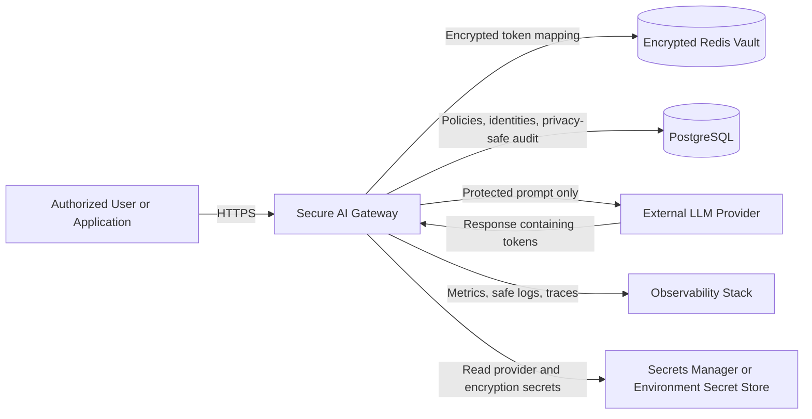
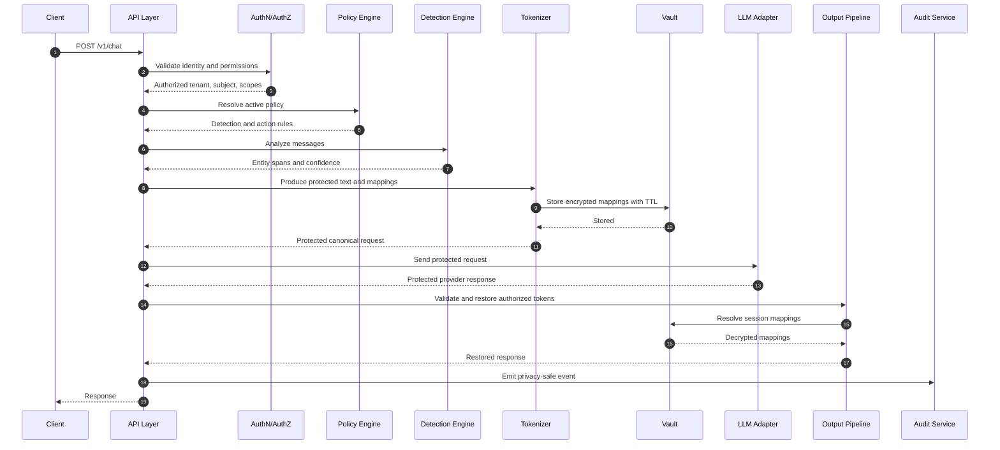
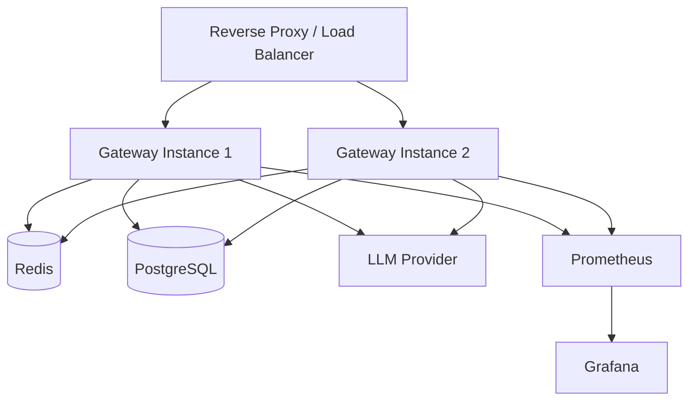

# Secure AI Gateway — Architecture Specification

**Document:** `architecture.md`  
**Status:** Implementation baseline  
**Audience:** Software architects, security engineers, backend engineers, DevOps engineers, Claude Code  
**Primary objective:** Prevent raw sensitive data from being transmitted to external LLM providers while preserving enough context for useful model reasoning.

---

## 1. Executive Summary

The Secure AI Gateway is a self-hosted privacy and policy enforcement layer positioned between client applications and external or internal large language model providers.

For every request, the gateway:

1. Authenticates and authorizes the caller.
2. Validates and normalizes the request.
3. Detects configured sensitive entities.
4. Replaces sensitive values with stable, typed, session-scoped tokens.
5. Stores the reversible mapping in an encrypted, session-isolated vault.
6. Sends only the protected prompt to the selected LLM provider.
7. inspects the provider response.
8. Restores original values only for authorized recipients.
9. Emits privacy-safe audit events and operational metrics.
10. Deletes mappings automatically when the session expires.

The initial implementation is a modular monolith built with Python and FastAPI. Redis is used as an ephemeral mapping vault. PostgreSQL is used for users, API clients, policies, provider configuration metadata, and privacy-safe audit records. Provider access is implemented behind an abstraction so OpenAI can be the first provider without coupling the security pipeline to one vendor.

---

## 2. Problem Statement

Enterprise prompts may contain personally identifiable information, protected health information, payment information, credentials, confidential identifiers, or other regulated data. Sending this data directly to an external LLM creates unnecessary exposure and complicates governance.

The gateway must ensure that external providers receive protected text such as:

```text
[PERSON:7F3A] was diagnosed with [MEDICAL_CONDITION:84C2].
Contact [EMAIL:19BD] for follow-up.
```

instead of:

```text
Jane Smith was diagnosed with diabetes.
Contact jane.smith@example.com for follow-up.
```

The gateway must later convert provider output containing the protected tokens back into authorized original values without placing the mapping in the model prompt.

---

## 3. Goals

### 3.1 Functional goals

- Provide a synchronous chat endpoint.
- Detect PII and configurable PHI or enterprise-sensitive entities.
- Support deterministic, reversible, session-scoped tokenization.
- Preserve repeated-entity consistency within a session.
- Store token mappings in an encrypted vault with TTL.
- Call an external LLM without transmitting original sensitive values.
- Restore recognized tokens in the model response.
- Prevent cross-session token restoration.
- Produce privacy-safe audit records.
- Support policy-based allow, tokenize, redact, pseudonymize, or block actions.
- Keep provider integrations replaceable.
- Expose health, readiness, and Prometheus metrics endpoints.
- Support local development with Docker Compose.

### 3.2 Security goals

- Raw sensitive values must not appear in provider-bound payloads.
- Raw sensitive values must not appear in application logs, traces, metrics, audit tables, exceptions, or dead-letter records.
- Vault records must be encrypted at the application layer before storage.
- Tokens must be unguessable, typed, and scoped to a tenant and session.
- Authorization must be checked before restoration.
- Session mappings must expire.
- Provider credentials must remain server-side.
- Fail closed when privacy processing cannot safely complete.

### 3.3 Quality goals

- Strong typing and modular boundaries.
- Unit, integration, privacy-regression, and security tests.
- Idempotent migrations and reproducible environments.
- Clear configuration through environment variables.
- Traceability through request IDs without logging prompt contents.

---

## 4. Non-Goals for Version 1

Version 1 does not attempt to provide:

- Formal HIPAA, GDPR, PCI DSS, FedRAMP, or other compliance certification.
- Perfect detection of every sensitive entity.
- Full data-loss-prevention coverage for files, images, audio, or video.
- Automatic clinical diagnosis or medical decision support.
- A general-purpose secrets-management product.
- Long-term storage of raw conversations.
- A full web administration dashboard.
- Multi-region active-active deployment.
- Differential privacy.
- Homomorphic encryption.
- Model-output factuality or hallucination guarantees.
- Autonomous prompt-injection classification using another external LLM.

These may be added later without weakening the core privacy boundary.

---

## 5. Architectural Principles

### 5.1 Privacy before availability

If the detector, tokenizer, vault, policy engine, or restoration authorization check fails, the system must not forward the original request to an external provider.

### 5.2 Stateless gateway, stateful vault

API instances remain horizontally scalable and do not store mappings in process memory. Reversible state belongs in the vault.

### 5.3 Provider isolation

Provider adapters receive only an already-protected canonical request. They must never receive direct access to vault APIs.

### 5.4 Least privilege

Each component, service account, API client, and operator receives the minimum permission required.

### 5.5 Data minimization

Store only what is needed, for only as long as needed. Audit logs contain classifications, counts, hashes, outcomes, and timing—not raw prompt or response content.

### 5.6 Explicit policy

Behavior is controlled through versioned policies. Security-sensitive defaults are deny or tokenize, not allow.

### 5.7 Defense in depth

Detection uses multiple recognizers, including pattern matching, checksums, NER, allowlists, denylists, and custom recognizers.

---

## 6. System Context



### Trust boundaries

1. **Client boundary:** Untrusted input enters the system.
2. **Application boundary:** Gateway code and internal services are trusted but still validated.
3. **Vault boundary:** Raw mappings exist only in encrypted form outside application memory.
4. **Provider boundary:** All data leaving this boundary must already be protected.
5. **Observability boundary:** No raw sensitive values may cross into logs, metrics, or traces.

---

## 7. High-Level Request Flow



---

## 8. Deployment Architecture

### 8.1 Version 1 topology



### 8.2 Runtime model

Use a modular monolith initially:

- One FastAPI deployment.
- Separate modules with dependency inversion.
- Redis and PostgreSQL as external state.
- Background cleanup is optional because Redis TTL is authoritative.
- Horizontal scaling is achieved by adding gateway replicas.

A later service split may extract detection, policy, or audit components when operational evidence justifies it.

---

## 9. Core Components

## 9.1 API Layer

**Responsibilities**

- Expose versioned HTTP endpoints.
- Parse and validate requests.
- Assign a request ID.
- Enforce body-size and message-count limits.
- Invoke authentication, authorization, rate limiting, and the secure pipeline.
- Convert domain errors into stable error responses.
- Never log request or response bodies.

**Inputs**

- HTTPS requests containing messages, provider alias, model alias, and optional session ID.

**Outputs**

- Restored completion, usage metadata, request ID, session ID, and privacy metadata safe for the caller.

**Failure behavior**

- Reject malformed requests with `400` or `422`.
- Reject unauthenticated requests with `401`.
- Reject unauthorized requests with `403`.
- Reject rate-limited requests with `429`.
- Return a sanitized `5xx` error without echoing prompt content.

---

## 9.2 Authentication and Authorization

Version 1 supports API-key authentication. JWT/OIDC can be added behind the same interface.

An API key record contains:

- `id`
- `tenant_id`
- `name`
- `key_prefix`
- `key_hash`
- `scopes`
- `status`
- `created_at`
- `expires_at`
- `last_used_at`

Only a one-way hash is stored. The raw API key is shown once at creation.

Required scopes:

- `chat:invoke`
- `detect:invoke`
- `sessions:delete`
- `audit:read`
- `admin:manage`

Authorization context:

```python
class Principal:
    subject_id: UUID
    tenant_id: UUID
    scopes: frozenset[str]
    api_key_id: UUID | None
```

Every session and vault lookup must include `tenant_id`. Session IDs alone are not sufficient authorization.

---

## 9.3 Policy Engine

The policy engine resolves one immutable policy snapshot for each request.

A policy defines:

- Supported entity types.
- Detection score thresholds.
- Entity action: `ALLOW`, `TOKENIZE`, `REDACT`, `PSEUDONYMIZE`, or `BLOCK`.
- Whether input restoration is permitted in output.
- Session TTL.
- Maximum request size.
- Provider and model allowlist.
- Input and output scanning settings.
- Unknown-token behavior.
- Streaming permission.
- Audit retention class.

Policy precedence:

1. Tenant-specific active policy.
2. Application-specific override.
3. System default.

The resolved policy version is recorded in the audit event.

---

## 9.4 Sensitive Data Detection Engine

The detector combines:

- Microsoft Presidio analyzer recognizers.
- Regex and checksum-based recognizers.
- spaCy-based NER where configured.
- Custom enterprise recognizers.
- Tenant allowlists and denylists.
- Context words to improve confidence.

Domain interface:

```python
class SensitiveDataDetector(Protocol):
    async def detect(
        self,
        text: str,
        language: str,
        entity_types: set[str] | None,
    ) -> list["DetectedEntity"]:
        ...
```

Entity model:

```python
class DetectedEntity:
    entity_type: str
    start: int
    end: int
    score: float
    recognizer: str
```

Initial entity types:

- `PERSON`
- `EMAIL_ADDRESS`
- `PHONE_NUMBER`
- `US_SSN`
- `CREDIT_CARD`
- `IP_ADDRESS`
- `LOCATION`
- `DATE_TIME`
- `US_DRIVER_LICENSE`
- `US_PASSPORT`
- `MEDICAL_RECORD_NUMBER`
- `HEALTH_PLAN_ID`
- `ACCOUNT_NUMBER`
- `API_KEY`
- `ACCESS_TOKEN`
- `CUSTOM_IDENTIFIER`

Medical conditions are not reliably detected by generic PII tooling. Treat PHI expansion as custom recognizers plus domain-specific models and policy testing, not as a guaranteed built-in capability.

### Overlap resolution

When recognizers produce overlapping spans:

1. Higher policy severity wins.
2. Higher confidence wins.
3. Longer span wins.
4. Deterministic recognizer priority breaks remaining ties.

### False-positive controls

- Exact allowlists.
- Context requirements.
- Minimum confidence by entity type.
- Checksum validation where applicable.
- Tests built from organization-specific examples.

---

## 9.5 Tokenization Engine

### Token requirements

Tokens must be:

- Typed.
- Opaque.
- Session-scoped.
- Tenant-scoped through vault lookup.
- Stable for repeated identical values within one session.
- Unlikely to occur naturally in text.
- Resistant to user fabrication.
- Easy to identify safely in provider output.

Canonical token format:

```text
⟦SGW:PERSON:01J8Z6J4M7Y9Q2K3T4V5W6X7Y8⟧
```

The final segment is a random ULID or equivalent cryptographically strong identifier. Do not use sequential tokens such as `PERSON_1` in production.

### Canonicalization

Repeated-entity consistency uses an HMAC of:

```text
tenant_id || session_id || entity_type || normalized_value
```

The HMAC is used only as an internal lookup index and is never sent externally.

Normalization is entity-specific:

- Emails: trim surrounding whitespace; preserve original case for restoration.
- Phone numbers: normalize digits for matching; preserve original format.
- Names: trim and collapse repeated whitespace; do not lowercase unless policy explicitly permits it.
- Identifiers: remove presentation separators only when recognizer semantics allow.

### Replacement algorithm

1. Detect all spans.
2. Resolve overlaps.
3. Sort spans descending by start offset.
4. For each span:
   - Apply policy action.
   - Generate or reuse a token.
   - Add mapping to an in-memory request collection.
   - Replace the span.
5. Persist all new mappings atomically.
6. Zero or release unnecessary plaintext references as soon as practical.

Replacing from right to left prevents offset invalidation.

### Policy actions

- `ALLOW`: leave text unchanged.
- `TOKENIZE`: replace with opaque typed token and store mapping.
- `REDACT`: replace with `⟦SGW:REDACTED:TYPE⟧`; do not store mapping.
- `PSEUDONYMIZE`: replace using a policy-approved surrogate; optionally store mapping.
- `BLOCK`: stop processing and return a policy violation.

---

## 9.6 Session Vault

Redis stores short-lived encrypted mappings.

### Key design

```text
sgw:v1:{tenant_id}:{session_id}:token:{token_id}
sgw:v1:{tenant_id}:{session_id}:fingerprint:{entity_type}:{value_hmac}
sgw:v1:{tenant_id}:{session_id}:meta
```

### Mapping payload before encryption

```json
{
  "schema_version": 1,
  "tenant_id": "uuid",
  "session_id": "uuid",
  "token": "opaque-token",
  "entity_type": "EMAIL_ADDRESS",
  "original_value": "jane@example.com",
  "created_at": "RFC3339 timestamp",
  "expires_at": "RFC3339 timestamp"
}
```

### Encryption

Use application-layer authenticated encryption:

- AES-256-GCM or ChaCha20-Poly1305.
- Random nonce per record.
- Associated data includes schema version, tenant ID, session ID, and token ID.
- Encryption keys are loaded from a secrets manager or environment-backed development secret.
- Key IDs support rotation.
- Plaintext encryption keys are never logged or stored in PostgreSQL.

Stored envelope:

```json
{
  "kid": "vault-key-2026-01",
  "alg": "AES-256-GCM",
  "nonce": "base64",
  "ciphertext": "base64"
}
```

### TTL

- Default: 30 minutes.
- Configurable policy range: 1–120 minutes.
- Every mapping and session metadata key receives TTL.
- Session extension is explicit and bounded.
- `DELETE /v1/sessions/{session_id}` removes all session mappings.

### Atomicity

Use a Redis transaction or Lua script to:

- Create the fingerprint index if absent.
- Create the encrypted token record.
- Set identical TTL values.
- Return an existing token for a repeated value.
- Avoid duplicate mappings under concurrency.

### Redis failure policy

If Redis is unavailable before the provider call, return `503` and do not call the provider.

If Redis becomes unavailable after the provider call but before restoration, return a sanitized `503`; do not return unresolved model output containing security tokens as a normal answer.

---

## 9.7 LLM Provider Abstraction

Provider adapters consume only protected canonical requests.

```python
class LLMProvider(Protocol):
    async def complete(self, request: "ProtectedChatRequest") -> "ProviderResponse":
        ...

    async def stream(self, request: "ProtectedChatRequest") -> AsyncIterator["ProviderChunk"]:
        ...

    async def health(self) -> "ProviderHealth":
        ...
```

Version 1 adapter:

- OpenAI provider adapter.
- Use the provider's current recommended text-generation API.
- Disable provider-side storage where supported and required by configuration.
- Set strict connection, read, and total timeouts.
- Apply bounded retries only for safe transient failures.
- Never retry policy violations or invalid requests.
- Record provider request IDs only when safe.

Future adapters may include Azure OpenAI, Anthropic, Amazon Bedrock, Gemini, and local models.

Provider configuration refers to aliases, not arbitrary caller-supplied base URLs. This prevents SSRF and unapproved egress.

---

## 9.8 Output Security and Restoration

The output pipeline:

1. Validates provider response structure.
2. Applies size limits.
3. Optionally scans for newly introduced sensitive data.
4. Finds gateway tokens with a strict parser.
5. Resolves only tokens belonging to the authenticated tenant and request session.
6. Restores mapped values.
7. Handles unknown or malformed tokens according to policy.
8. Emits privacy-safe result metadata.

### Token parser

Do not restore through unconstrained global string replacement. Parse the exact token grammar and match complete tokens only.

### Unknown-token behavior

Default behavior:

- Keep unknown tokens protected.
- Add a warning flag to metadata.
- Never search other sessions.
- Never infer a value.
- Never expose whether a token exists in another tenant.

### Newly generated PII

A model may generate PII-like text not present in the input. Output scanning can:

- Allow.
- Redact.
- Block.
- Require human review.

Version 1 defaults to scanning and reporting counts without claiming perfect prevention.

---

## 9.9 Audit Service

Audit records must not contain raw prompts, raw responses, decrypted values, provider credentials, or complete gateway tokens.

Suggested fields:

- `id`
- `timestamp`
- `request_id`
- `tenant_id`
- `principal_id`
- `api_key_id`
- `session_id_hash`
- `policy_id`
- `policy_version`
- `provider_alias`
- `model_alias`
- `input_character_count`
- `output_character_count`
- `entity_counts_json`
- `actions_json`
- `blocked`
- `block_reason_code`
- `provider_latency_ms`
- `pipeline_latency_ms`
- `status_code`
- `error_code`
- `prompt_hmac`
- `response_hmac`

Use keyed HMACs for correlation; do not use unsalted plain hashes for sensitive text.

Audit writes must not delay the response indefinitely. Use an in-process bounded queue in version 1, with safe fallback counters. Never queue raw content.

---

## 9.10 Logging, Metrics, and Tracing

### Logs

Use structured JSON logs with:

- timestamp
- level
- request_id
- tenant_id
- route
- status_code
- error_code
- duration_ms

Prohibited:

- request bodies
- response bodies
- original sensitive values
- decrypted mappings
- authorization headers
- API keys
- provider keys
- full gateway tokens

Install a defensive log filter that masks token grammar and common secrets even if a developer accidentally includes them.

### Metrics

Initial Prometheus metrics:

- `sgw_http_requests_total`
- `sgw_http_request_duration_seconds`
- `sgw_detection_duration_seconds`
- `sgw_entities_detected_total{entity_type,action}`
- `sgw_policy_blocks_total{reason}`
- `sgw_vault_operations_total{operation,result}`
- `sgw_vault_duration_seconds`
- `sgw_provider_requests_total{provider,model,result}`
- `sgw_provider_duration_seconds{provider,model}`
- `sgw_restoration_unknown_tokens_total`
- `sgw_active_requests`
- `sgw_audit_queue_depth`

Do not use tenant ID, user ID, session ID, request ID, or token values as metric labels.

### Tracing

Trace spans may contain component names, timing, and result codes. Prompt text and mappings are forbidden span attributes.

---

## 10. API Contract Summary

### `POST /v1/chat`

Request:

```json
{
  "session_id": "optional UUID",
  "provider": "openai-primary",
  "model": "general-chat",
  "messages": [
    {"role": "user", "content": "My email is jane@example.com"}
  ],
  "temperature": 0.2,
  "max_output_tokens": 800
}
```

Response:

```json
{
  "request_id": "UUID",
  "session_id": "UUID",
  "message": {
    "role": "assistant",
    "content": "I will use jane@example.com for follow-up."
  },
  "privacy": {
    "entities_detected": 1,
    "entities_tokenized": 1,
    "unknown_tokens": 0,
    "policy_version": 3
  },
  "usage": {
    "input_tokens": 18,
    "output_tokens": 12
  }
}
```

### `POST /v1/detect`

Administrative or diagnostic endpoint. It returns spans, types, scores, and intended actions. It must require a dedicated scope. By default, it must not echo original values.

### `DELETE /v1/sessions/{session_id}`

Deletes all mappings for the caller's tenant and specified session.

### `GET /health/live`

Confirms the process is alive. It must not require external dependencies.

### `GET /health/ready`

Checks required dependencies, including Redis, PostgreSQL, and provider configuration. It should not perform a paid model inference.

### `GET /metrics`

Prometheus endpoint, protected by network policy or dedicated authentication.

---

## 11. Canonical Domain Models

```python
class ChatMessage(BaseModel):
    role: Literal["system", "user", "assistant"]
    content: str

class ChatRequest(BaseModel):
    session_id: UUID | None = None
    provider: str
    model: str
    messages: list[ChatMessage]
    temperature: float | None = None
    max_output_tokens: int | None = None

class EntityAction(str, Enum):
    ALLOW = "allow"
    TOKENIZE = "tokenize"
    REDACT = "redact"
    PSEUDONYMIZE = "pseudonymize"
    BLOCK = "block"

class EntityMapping:
    token: str
    token_id: str
    entity_type: str
    original_value: str
    normalized_hmac: str

class ProtectedChatRequest:
    request_id: UUID
    tenant_id: UUID
    session_id: UUID
    provider_alias: str
    model_alias: str
    messages: list[ChatMessage]
```

The protected request type must be distinct from the raw request type to reduce accidental provider calls with unprocessed data.

---

## 12. Data Model

### PostgreSQL tables

#### `tenants`

- `id UUID PK`
- `name TEXT`
- `status TEXT`
- timestamps

#### `api_keys`

- identity and one-way key hash
- tenant relationship
- scopes
- expiry and status

#### `policies`

- `id UUID PK`
- `tenant_id UUID NULL`
- `name`
- `version`
- `document JSONB`
- `is_active`
- timestamps
- unique `(tenant_id, name, version)`

#### `provider_configs`

- aliases and non-secret metadata
- model allowlists
- timeout and retry policies
- secret reference, not secret value

#### `audit_events`

- privacy-safe metadata described earlier
- partitionable by month later

### Redis

Redis is authoritative only for ephemeral mapping state. It is not a system of record for users, policies, or audit.

---

## 13. Security Controls

### Input controls

- Maximum HTTP body size.
- Maximum number of messages.
- Maximum characters per message.
- Unicode normalization policy.
- Reject invalid encodings and control-character abuse.
- Restrict roles.
- Restrict provider and model aliases.
- Rate limit per API key and tenant.
- Optional prompt-injection heuristics operate independently from PII protection.

### Network controls

- HTTPS at ingress.
- TLS to Redis and PostgreSQL in non-local environments.
- Egress allowlist for approved LLM provider hosts.
- No caller-controlled URLs.
- Private subnets for data stores.
- Network policies between workloads.

### Secret controls

- Secrets loaded at runtime.
- No secrets committed to source control.
- `.env.example` contains names only.
- Provider keys scoped and rotated.
- Vault encryption key rotation through `kid`.
- Startup validation rejects missing or weak secrets.

### Application controls

- Parameterized database access.
- Pydantic validation.
- Safe error mapping.
- Dependency pinning and vulnerability scanning.
- CSRF is not relevant for API-key-only service but must be addressed when browser sessions are added.
- CORS is deny-by-default.

---

## 14. Threat Model Summary

| Threat | Example | Control |
|---|---|---|
| PII exfiltration | Raw SSN sent to provider | Mandatory detection and tokenization; provider adapter accepts protected type only |
| Log leakage | Prompt included in exception | Body-free structured logs and redaction filter |
| Cross-tenant restoration | Token from tenant A used by tenant B | Tenant-qualified vault keys and authorization context |
| Token guessing | Attacker fabricates `PERSON_1` | Random opaque token IDs and strict parser |
| Session fixation | Caller selects another session | Tenant ownership validation and unguessable UUIDs |
| Replay | Reusing old session token | TTL, API authentication, bounded session lifetime |
| Vault theft | Redis snapshot exposed | Application-layer authenticated encryption |
| SSRF | Caller supplies provider URL | Provider aliases and egress allowlist |
| Provider outage | Timeout causes insecure bypass | Fail closed; never send raw fallback request |
| Prompt injection | Prompt asks system to expose tokens | Tokens are placeholders; mapping never enters model context |
| Mapping oracle | Error reveals token existence | Uniform unknown-token behavior |
| Denial of service | Huge prompt or many entities | Body, entity, concurrency, and rate limits |
| Supply-chain compromise | Malicious package update | Lock file, hashes where supported, scanning, minimal dependencies |

A full STRIDE review should be maintained as the project evolves.

---

## 15. Failure Modes

### Detector unavailable

Return `503 PRIVACY_DETECTOR_UNAVAILABLE`. Do not call provider.

### Unsupported language

Apply policy. Default is block with `422 UNSUPPORTED_LANGUAGE`, not silent bypass.

### Too many entities

Return `413 ENTITY_LIMIT_EXCEEDED` or block according to policy.

### Vault write failure

Return `503 VAULT_UNAVAILABLE`. Do not call provider.

### Provider timeout

Return `504 PROVIDER_TIMEOUT`. Keep mappings until normal TTL.

### Provider returns malformed data

Return `502 PROVIDER_RESPONSE_INVALID`.

### Restoration failure

Return `503 RESTORATION_FAILED`. Do not silently expose unresolved output as a successful response.

### Audit write failure

Complete request only if the configured audit policy permits. Increment a high-priority metric and log a privacy-safe event.

---

## 16. Performance and Capacity Targets

Initial service-level objectives, excluding provider generation time:

- p50 gateway overhead: under 100 ms for 4 KB English text.
- p95 gateway overhead: under 250 ms for 16 KB English text.
- Redis operation p95: under 20 ms in-region.
- Availability target: 99.9% after production hardening.
- Maximum request body: 256 KB by default.
- Maximum entities per request: 500 by default.
- Default concurrent provider calls per instance: configurable bounded semaphore.

These are engineering targets, not guarantees. Benchmark with representative prompts and recognizers.

---

## 17. Streaming Architecture

Streaming is deferred until synchronous restoration is correct.

When implemented:

1. Buffer partial text that may contain an incomplete gateway token.
2. Parse only complete tokens.
3. Restore complete authorized tokens.
4. Never emit partial token fragments.
5. Bound the buffer.
6. Preserve ordering and cancellation.
7. Stop and close safely on vault failure.

Do not implement naive per-chunk `replace()` logic.

---

## 18. Multi-Tenancy

Every persistent and ephemeral record is tenant-scoped.

Rules:

- Tenant identity comes from the authenticated principal, never request body.
- All SQL queries include tenant filters or use repository methods that require tenant ID.
- Redis keys include tenant ID.
- Provider and model access is policy-scoped.
- Audit readers can access only their tenant unless they have system-admin scope.
- Tests must include deliberate cross-tenant access attempts.

---

## 19. Configuration

Required environment variables:

```text
APP_ENV
APP_HOST
APP_PORT
DATABASE_URL
REDIS_URL
API_KEY_PEPPER
VAULT_ACTIVE_KEY_ID
VAULT_KEY_<KEY_ID>
AUDIT_HMAC_KEY
OPENAI_API_KEY
LOG_LEVEL
```

Optional:

```text
DEFAULT_SESSION_TTL_SECONDS
MAX_REQUEST_BYTES
MAX_MESSAGE_CHARS
MAX_ENTITIES_PER_REQUEST
PROVIDER_CONNECT_TIMEOUT_SECONDS
PROVIDER_READ_TIMEOUT_SECONDS
CORS_ALLOWED_ORIGINS
OTEL_EXPORTER_OTLP_ENDPOINT
```

Use a typed settings class. Fail startup on invalid production configuration.

---

## 20. Repository Structure

```text
secure-ai-gateway/
├── architecture.md
├── implementation.md
├── README.md
├── pyproject.toml
├── uv.lock
├── .env.example
├── docker-compose.yml
├── Dockerfile
├── alembic.ini
├── app/
│   ├── main.py
│   ├── api/
│   │   ├── dependencies.py
│   │   ├── errors.py
│   │   └── v1/
│   │       ├── chat.py
│   │       ├── detect.py
│   │       ├── health.py
│   │       └── sessions.py
│   ├── auth/
│   ├── audit/
│   ├── config/
│   ├── detection/
│   ├── domain/
│   ├── llm/
│   ├── observability/
│   ├── pipeline/
│   ├── policy/
│   ├── repositories/
│   ├── restoration/
│   ├── tokenization/
│   └── vault/
├── migrations/
├── scripts/
├── tests/
│   ├── unit/
│   ├── integration/
│   ├── privacy/
│   ├── security/
│   └── performance/
└── deploy/
    ├── compose/
    └── kubernetes/
```

---

## 21. Architectural Decisions

### ADR-001: Modular monolith first

Reason: simpler transactions, testing, deployment, and debugging. Service extraction remains possible because module interfaces are explicit.

### ADR-002: Redis as ephemeral vault

Reason: low-latency session mappings and native TTL. Application-layer encryption is mandatory.

### ADR-003: PostgreSQL for durable metadata and audit

Reason: relational integrity, migrations, JSONB policy documents, and operational maturity.

### ADR-004: Presidio plus custom recognizers

Reason: Presidio supplies an extensible recognition framework; enterprise accuracy still requires custom patterns and evaluation.

### ADR-005: Opaque random tokens

Reason: sequential placeholders are guessable and may collide with natural user text.

### ADR-006: Fail closed

Reason: availability degradation is preferable to accidental transmission of raw sensitive data.

### ADR-007: Provider adapter receives protected types only

Reason: make insecure direct calls harder through type and module boundaries.

---

## 22. Definition of Done

The architecture is implemented when:

- Raw sensitive values are never observed in mocked provider requests.
- Mapping records are encrypted in Redis.
- Cross-session and cross-tenant restoration tests fail safely.
- Repeated values use stable tokens within a session.
- Expired sessions cannot restore values.
- Logs, traces, metrics, and audits pass privacy scans.
- The service runs through Docker Compose.
- Unit and integration tests pass in CI.
- A threat-model review finds no known critical path that bypasses the secure pipeline.
